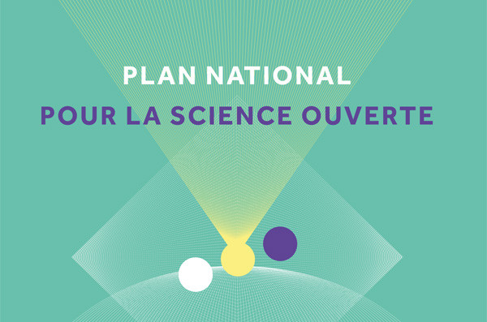
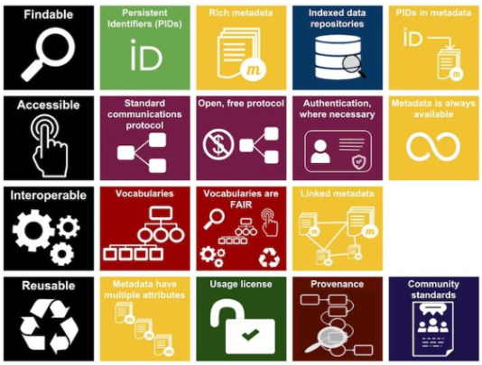

class: center, inverse, middle 

# gérer, diffuser et partager ses données de recherche

### Damien Belvèze

<small> 29 avril 2022 </small>

<!--conformément aux usages sur R, je n'ai pas entré de commande pour le chargement automatique des paquets utilisés (install.packages), je me suis limité à charger ces packages. S'ils sont manquants dans la configuration de l'utilisateur, celui-ci sera seulement incité à les installer. 
Les packages demandés sont Xaringan, Xaringanbuilder, pagedown. 
J'ai commenté les packages et les commandes qui permettent de créer des citations dans les slides à partir d'un fichier de références en format bibtex
-->

---

background-color: #bebebe
class: middle, center

# De quoi parle t-on ?

### Quelques définitions concernant les données de la recherche

```{r warning=FALSE, echo=FALSE, message=FALSE}
# library(devtools)
# library(bibtex)
library(xaringan)
# library(knitcitations)
# write.bib(c('bibtex', 'knitr', 'knitcitations'), 
# file="data_presentation.bib")
```

???

Pour afficher les notes des diapositives, cliquer sur la touche p


---

* **Données de recherche** (research data): « Enregistrements factuels (chiffres,textes, images et sons), qui sont utilisés comme sourcesprincipales pour la recherche scientifique et sont généralement
reconnus par la communauté scientifiqe comme nécessaires pour valider des résultats de recherche. » (OCDE, 2007)


--

* **Jeux de données** ( datasets ) « Agrégation (...) de données brutes ou dérivées présentant une certaine "unité" unité", rassemblées pour former un ensemble cohérent » (Gaillard, 2014)

--

* **science ouverte** (Open Science) :
> La science ouverte est la pratique de la science de manière à ce que d'autres puissent collaborer et contribuer, où les données de recherche, les notes de laboratoire et les autres processus de recherche sont librement disponibles, dans des conditions qui permettent la réutilisation, la redistribution et la reproduction de la recherche et des données et méthodes sous-jacentes.

???

* **données de la recherche** : ce terme exclut donc :
- Les analyses préliminaires, 
- Les programmes de travaux futurs, 
- Les examens par les pairs, 
- Les communications personnelles avec des collègues comme des mails. 
- Les objets matériels, 
- Les supports de formation,
- Les données administratives


les cahiers numériques ou carnets de laboratoire, les analyses préliminaires, les preprints, les working papers, les objets matériels pouvant être échangés entre collègues. 
Les données de la recherche s'inscrivent dans la catégorie plus large des _inscriptions_ (Bruno Latour) : objets intermédiaires des savoirs produits en amont de la publication.

* **science ouverte**

** réutilisation & redistribution : code par exemple (cf. les 4 libertés du logiciel libre selon Richard R Stallman)

** reproduction de la recherche : crise de la reproductibilité

---

class: middle

## De quelles données parle t-on ? 

.pull-left[
```{r echo=FALSE,out.height=450}
knitr::include_graphics("images/data_narrative.jpg")
```
]

.pull-right[

* Données brutes
* Données traitées ou dérivées
* Données analysées ou interprétées

> Data doesn’t say anything. Humans say things. (Andreo Jones-Rooy)

]


---
## des données inégalement mises à disposition

Dès 1997, les pionniers du web s'intéressent à la manière dont les données doivent être structurées pour être réutilisables.

.center[
```{r echo=FALSE,out.height=400}
knitr::include_graphics("images/5-star-steps.png")
```
]

???

* licence ouverte
* format structuré
* format libre
* disposant d'URL
* liés à d'autres data

---

background-color: #fcf6ef
color: white
class: middle, center

# Et vous, quelles sont vos données ?


---
class:middle,center

## le cycle de vie de la donnée

```{r echo=FALSE, fig.align='center', out.height=400}
knitr::include_graphics("images/data_cycle.png")
```
Source: [Colorado State University Library](https://guides.library.csupueblo.edu/data/lifecycle)

---
# Les enjeux liés à la conservation et au partage des données

## Enjeux économiques

> les données de la recherche sous forme numérique sont de plus en plus utilisées dans des travaux qui vont au delà du projet en vue duquel elles ont été recueillies à l’origine, ainsi
que dans d’autres domaines de recherche et dans l’industrie

[Rapport de l'OCDE de 2007](https://www.oecd.org/fr/science/inno/38500823.pdf)

???

coût associé à leur production (un séquençage de génome = 1500 euros) mais aussi rentabilité de leur monétisation

Les financeurs insistent sur le levier de croissance que représenterait un accès facilité aux données de la recherche (concept néo-libéral d'économie de la connaissance).

---

class: middle, center

## Enjeux de santé

### le partage des données médicales fait progresser la médecine. 

Importance du recueil et de la diffusion des _meta-analyses sur données individuelles_

>Sans recruter un patient de plus, grâce à une méta-analyse sur données individuelles, l’Institut Gustave-Roussy a réussi à montrer que la chimiothérapie concomitante est plus efficace que le schéma séquentiel (Florian Naudet, Claude Pellen)

Source : [The conversation](https://theconversation-com.cdn.ampproject.org/c/s/theconversation.com/amp/quand-partager-les-donnees-issues-des-essais-cliniques-permet-de-mieux-soigner-les-patients-171130)


---
## Enjeux démocratiques

### la donnée comme bien commun de la connaissance

Obépine (projet de recherche) = taux de Sars-Cov-2 dans les eaux usées - demande CADA

> "Vous avez formulé le 20 novembre 2020 une demande d’ouverture des données du projet de recherche Obépine."

> "Votre demandes d’accès s’inscrit dans le cadre de la loi 2016-1321 du 7 octobre 2016 pour une République numérique (dite "loi Lemaire") en faveur de la "circulation des données et du savoir"

> J’ai le plaisir de vous informer que nous rendrons disponibles et réutilisables les données de courbe de tendance dans les meilleurs délais

[demande Dada](https://madada.fr/demande/donnees_relatives_a_la_concentra#outgoing-411)

### data ou capta ?

Consentement de la personne, RGPD

---

# Les enjeux liés à la conservation et au partage des données

## Enjeux scientifiques

Un enjeu de reproductibilité et donc de fiabilité de la science. 

ex. Rétractation en 2020 d'un article du Lancet sur l'hydroxychloroquine. Les auteurs...

> « n’ont pas été en mesure d’effectuer un audit indépendant des données qui sous-tendent leur analyse », écrit The Lancet. En conséquence, ils ont conclu qu’ils « ne peuvent plus garantir la véracité des sources de données primaires. 

[Le Monde, 4 juin 2020](https://www.lemonde.fr/sciences/article/2020/06/04/hydroxychloroquine-trois-auteurs-de-l-etude-du-lancet-se-retractent_6041803_1650684.html)

---

class: middle, center

## L'accès aux données et aux traitements sur ces données : une garantie de reproductibilité

.pull-left[
```{r echo=FALSE,out.width=900}
knitr::include_graphics("images/reproducible.png")
```
]

.pull-right[
poor quality control on data
Manifesto for reproducible science

]

???

La citation est tronquée (problème de Knitcitations)
La citation complète est celle-ci : 

Munafò, M. R. et al. A manifesto for reproducible science. Nat Hum Behav 1, 1–9 (2017).

---

## un manque de pérennité de ces données

80 % des données produites ces 20 dernières années seraient perdues (Vines, Albert, 2014).

.pull-left[
```{r echo=FALSE,out.width=600}
knitr::include_graphics("images/perte_donnees.png")
```
]

.pull-right[
PLus le temps passe et plus les données associées à une publication disparaissent
]

---

class: middle, center

## Comment ça devrait être et comment c'est

.pull-left[
```{r echo=FALSE,out.width=600}
knitr::include_graphics("images/data_pyramid1.png")
```
]

.pull-right[
```{r echo=FALSE,out.width=600}
knitr::include_graphics("images/data_pyramid2.png")
```
]

(Marie Puren, 2021)

???

* Plus de 80 % des données produites sont stockées ailleurs que dans des entrepôts.

* 90 % des chercheurs interrogés dans le cadre d’un sondage européen disent effectuer de manière individuelle le stockage, l’archivage ou la transmission de leurs données.\

Source: [DATACC, Gestion des données, une nouvelle exigence, de nouvelles compétences, 2020](https://www.datacc.org/bonnes-pratiques/adopter-un-plan-de-gestion-des-donnees/gestion-des-donnees-une-nouvelle-exigence-de-nouvelles-competences/)
---

class: middle, center

## Le Plan National pour la Science Ouverte

.pull-left[
```{r echo=FALSE,out.width=800}

```
]

.pull-right[

* Généraliser l'accès ouvert aux publications
* **Structurer, partager et ouvrir les données de la recherche**
* Ouvrir et promouvoir les codes sources produits par la recherche
* Transformer les pratiques pour faire de la science ouverte le principe par défaut

[Ministère de l'enseignement supérieur et de la recherche](https://www.enseignementsup-recherche.gouv.fr/fr/le-plan-national-pour-la-science-ouverte-2021-2024-vers-une-generalisation-de-la-science-ouverte-en-48525)

]

---

background-color: #bebebe
class: middle, center

# Les principes FAIR

## Findable / Accessible / Interoperable / Reusable

```{r echo=FALSE,out.width=500}

```

---

class: left, middle

## Comment rendre mes données _trouvables_

* dataset -> DOI (exemple : [https://doi.org/10.5281/zenodo.5903186](https://doi.org/10.5281/zenodo.5903186))

* Les répertoire de données doivent être correctement indexés par les moteurs de recherche (thesaurus -> SKOS)

---

class: middle, left

## comment rendre mes données accessibles ?

> aussi ouvertes que possible, aussi fermées que nécessaires

être explicite sur le type de partage et les modalités de partage prévues pour ce jeu de données

???

* données ouvertes : préciser la licence

* données accessibles sur demande : expliquer comment et à qui envoyer une demande, comment formaliser une demande. 


Les données qui ne doivent pas être diffusées

* secret défense
* délibérations du gouvernement
* secret des affaires

Les données qui peuvent être diffusées après traitement (anonymisation) ou accord des parties

* données personnelles ou sensibles
* propriété intellectuelle : pour qu’un établissement puisse faire payer une redevance pour la diffusion de ses données, son activité doit représenter au moins 25% de la production de données. (Météo France et IGN, Eliane Caillou)

* risque pour la protection du patrimoine informationnel

---

class: left, middle

# avantage citationnel

Les articles qui donnent un accès explicite dans un entrepôt distant ont un **bénéfice de citations de 25%**

```{r echo=FALSE,out.width=800}
knitr::include_graphics("images/data_citation_advantage.png")
```


---

class: left, middle

## Comment rendre mes données interopérables

* utiliser des formats ouverts de données

* utiliser des vocabulaires qui font référence dans le domaine de recherche

---

class: center, middle

# et pourquoi je partagerais MES données ?

.pull-left[
```{r echo=FALSE,out.width=600}

```
]

.pull-right[

* C'est beaucoup de travail de les obtenir

* ces données confèrent à mon labo un avantage concurrentiel

* Loi Lemaire : le public préempte les données pour éviter qu'elles deviennent la propriété d'acteurs privés (enclosures)

* Les données du chercheur appartiennent en fait à son employeur (contrairement à ces oeuvres)
]

???

Loi Valter 2015 : Le législateur a protégé les données contre un risque d’accaparement. Quels que soient les droits cédés à un éditeur ou à un tiers, les données sont protégés dans les contrats de session de droits. Les données ne lui appartiennent pas. (Eliane Caillou)


---
background-color: #bebebe
class: middle, center

# créer un plan de gestion de données

---
class:middle, center

# où trouver des exemples, des modèles ?

* _templates_ et exemples disponibles sur https://dmp.opidor.fr

* Pour trouver un **plan de gestion de données    structuré** (machine-readable), suivre la [procédure indiquée sur le site](https://github.com/OPIDoR/DMPOPIDoR/blob/dmpopidor-master/public/files/DMPOPIDoR/DMPOPIDoRV3_Guide_Utilisateur.pdf)

---
class: left, middle

## Obligatoire dans le cadre des financements ANR

## au plus tard 6 mois après la signature du contrat

--

.red[ Le PGD indique comment les données vont être collectées, traitées de telle sorte qu'elles soient conformes aux principes FAIR ]

---
class: left, middle

# Où doivent être conservées les données ?

.red[
** Pas chez l'éditeur**
]

* répertoires de données = plus de latitude pour commenter les données

* l'hébergement des données par l'éditeur \# ouverture des données ou réutilisations possibles

* les multinationales de l'édition scientifique peuvent avoir un usage de ces données qui est contraire à l'esprit de la Science ouverte


---
class: left, middle

# Où seront conservées les données alors ?


* Déposer ses données dans un entrepôt **avant de publier** (une fois l'article publié, plus possible de faire un lien de l'article vers le jeu de données sur le site de l'éditeur) comme on peut le faire en revanche sur l'entrepôt de données vers le site de l'éditeur.
Le seul moyen qui nous reste est de faire un lien dans le MAA qu'on dépose sur l'archive ouverte.

* possibilité de réserver un emplacement (ID) sur un entrepôt de données avant de déposer les données et faire mention de cet ID (DOI) dans l'article qu'on rédige, même si l'emplacement est encore vide des données qu'on va y verser après publication.

* jeu de données original -> prévoir avant la bibliographie un espace "disponibilité des données", 
* jeu de données réutilisé, le mentionner dans la bibliographie. 

???

Déposer ses données dans un entrepôt **avant de publier** (une fois l'article publié, plus possible de faire un lien de l'article vers le jeu de données sur le site de l'éditeur) comme on peut le faire en revanche sur l'entrepôt de données vers le site de l'éditeur.
**Le seul moyen qui nous reste est de faire un lien dans le MAA qu'on dépose sur l'archive ouverte.**

---
class: left, middle

# réfléchir au coût de la préservation des données

* Le coût de la préservation des données doit être pesé par rapport au coût de leur génération / collecte

* Données difficiles ou coûteuses à collecter > plus longue préservation. (exemple : le reséquençage est devenu moins coûteux que la préservation ) 

---
class: middle, left

# la conservation sous l'angle de la reproductibilité : 

* conserver les données initiales et bien documenter les divers traitements

* données computationnelles : virtualisation (Docker) et versions des traitements (github)

* Ne pas conserver les données issues des traitements successifs

> tout ce qui peut être rejoué, peut être supprimé, on n’aura perdu que du temps de calcul" (Olivier Collin)

---
class: left, middle

# De l'importance de documenter ses données

fichier README déposé en même temps que les données qui précise ce qu'il y a dans le PGD: 

- organisation et localisation des fichiers de données

- nature des observations et variables présentes dans les fichiers

- détails sur les conditions d'expérimentation qui ont permis la collecte des données

- détails sur les traitements informatiques faits sur les données

---
class: middle, left

# description : ontologies et thésaurus. 

## Ontologies : 

- [ontologies génomiques](http://geneontology.org/) 
- [ontologies biologiques](https://www.ebi.ac.uk/ols/ontologies/uberon) 

## thésaurus :

- [MeSH](https://www.ncbi.nlm.nih.gov/mesh/?) (médecine)
- [thésaurus de l'INRAE](https://consultation.vocabulaires-ouverts.inrae.fr/thesaurus-inrae/fr/)

---

class: middle, left

## La description montre comment interpréter les données

```{r echo=FALSE, fig.align='center', out.height=450}
knitr::include_graphics("images/data_context.png")
```


---
class: middle, left

# la publication sous l'angle de la vie privée

pseudonymiser ou anonymiser

Outils : [Amnesia](https://amnesia.openaire.eu/download.html) et [Arx](https://arx.deidentifier.org/)

* Anonymiser un jeu de données consiste non pas à pseudonymiser les enregistrements mais à faire disparaître les informations nominatives tout en essayant de rendre difficiles les opérations de réidentification.

* Plus les données personnelles contenues dans un fichier sont nombreuses et plus les risques de [réidentification](https://cpg.doc.ic.ac.uk/observatory/explore) sont importants.

---

class: left, middle, inverse

# crédits

Cette présentation est très inspirée de deux autres présentations : 

* Thierry Fournier, [introduction aux données de la recherche en sciences exactes](http://formadoct.doctorat-bretagneloire.fr/ld.php?content_id=33694689), 2022

* Cécile Arènes, [Rédiger un plan de gestion des données](https://zenodo.org/record/5559598), 2021


---

class: left, middle, inverse

# Références

<small>
Blanc, I. (2020, novembre 20). Données relatives à la concentration de SARS-CoV-2 dans les eaux usées—Une demande d’accès à l’information à Ministère de l’enseignement supérieur, de la recherche et de l’innovation. Consulté 14 avril 2022, à l’adresse Ma Dada website: https://madada.fr/demande/donnees_relatives_a_la_concentra

Brunori, G. (2020). Data Management Plan. https://doi.org/10.5281/zenodo.3664215
Colavizza, G., Hrynaszkiewicz, I., Staden, I., Whitaker, K., & McGillivray, B. (2020). The citation advantage of linking publications to research data. PLOS ONE, 15(4), e0230416. https://doi.org/10.1371/journal.pone.0230416

Munafò, M. R., Nosek, B. A., Bishop, D. V. M., Button, K. S., Chambers, C. D., Percie du Sert, N., … Ioannidis, J. P. A. (2017). A manifesto for reproducible science. Nature Human Behaviour, 1(1), 1‑9. https://doi.org/10.1038/s41562-016-0021
OCDE. (2007). Principes et lignes directrices de l’OCDE pour l’accès aux données de la recherche financée sur fonds publics. Consulté à l’adresse https://www.oecd.org/fr/science/inno/38500823.pdf

Sandve, G. K., Nekrutenko, A., Taylor, J., & Hovig, E. (2013). Ten Simple Rules for Reproducible Computational Research. PLOS Computational Biology, 9(10), e1003285. https://doi.org/10.1371/journal.pcbi.1003285
« The Lancet » annonce le retrait de son étude sur l’hydroxychloroquine. (2020, juin 4). Le Monde.fr. Consulté à l’adresse https://www.lemonde.fr/sciences/article/2020/06/04/hydroxychloroquine-trois-auteurs-de-l-etude-du-lancet-se-retractent_6041803_1650684.html

Vines, T. H., Albert, A. Y. K., Andrew, R. L., Débarre, F., Bock, D. G., Franklin, M. T., … Rennison, D. J. (2014). The Availability of Research Data Declines Rapidly with Article Age. Current Biology, 24(1), 94‑97. https://doi.org/10.1016/j.cub.2013.11.014

</small>

---
````{r warning=FALSE, echo=FALSE, eval=FALSE,  message=FALSE}


library(pagedown)

Sys.setenv(PAGEDOWN_CHROME = "C:/Program Files/Google/Chrome/Application/chrome.exe")

Sys.setenv(CHROMOTE_CHROME = "C:/Program Files/Google/Chrome/Application/chrome.exe")

citation("xaringanBuilder")

library(xaringanBuilder)

Sys.setenv(CHROMOTE_CHROME = "C:/Program Files/Google/Chrome/Application/chrome.exe")

build_pdf("D:/Home/dbelveze/Documents/Presentations_Rmarkdown/20220429_donnees_recherche/20220429_donnees_recherche.Rmd", output_file = "gestion_donnees_recherche.pdf")
````

