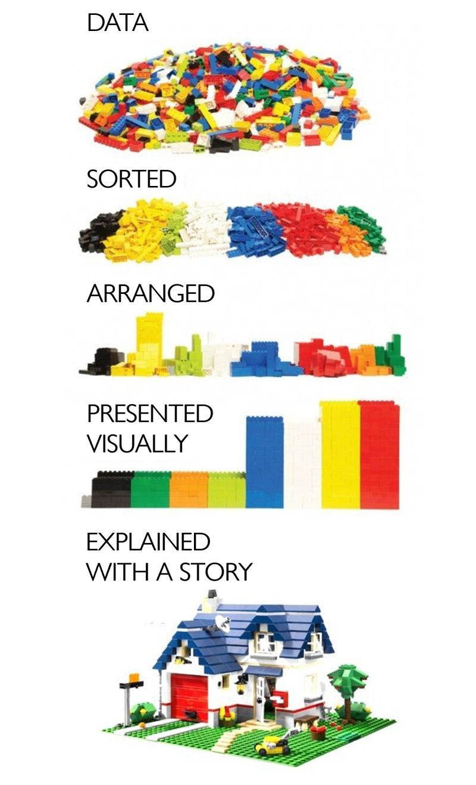
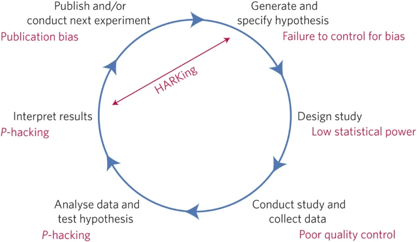
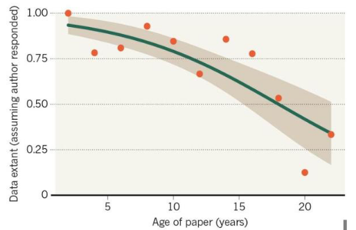
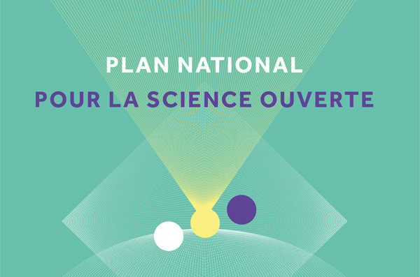
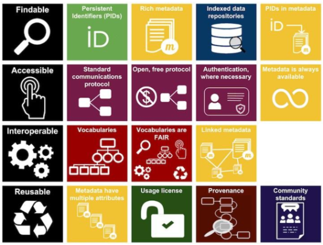
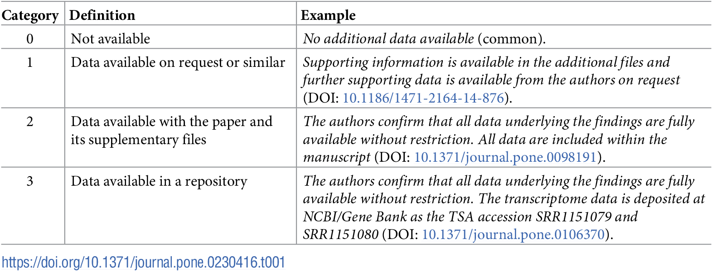

class: center, inverse, middle 

# Introduction to data management in hard science

### Damien Belvèze

<small> 29th of april 2022 </small>

<!--in accordance with R usage, I did not insert any command to automatically load the packages used (install.packages), I only call these packages. If they are missing in the user's Rmarkdown environment, the user will only be prompted to install them..  
-->

---

background-color: #bebebe
class: middle, center

# Research Data: What are we talking about?

### some definitions on data management

```{r,echo=FALSE,message=FALSE, warning=FALSE}
library(bibtex)
library(xaringan)
library(knitcitations)
write.bib(c('bibtex', 'knitr', 'knitcitations'), file="data_presentation.bib")
```

???

The speaker may display presentation notes by pressing the p key


---

* **research data**: "recorded objects (figures,texts, images or sounds), which are used as main sources for scientific inquiry and are generally considered by the scientific community as compulsory to valid scientific results" (OECD, 2007)


--

* **Jeux de données** ( datasets ) « Aggregation (...) of raw data ou intermediary data with some unity, gathered in order to form a consistent whole » (Gaillard, 2014)

--

* **Open Science** :
> La science ouverte est la pratique de la science de manière à ce que d'autres puissent collaborer et contribuer, où les données de recherche, les notes de laboratoire et les autres processus de recherche sont librement disponibles, dans des conditions qui permettent la réutilisation, la redistribution et la reproduction de la recherche et des données et méthodes sous-jacentes.

???

* **données de la recherche** : * **données de la recherche** : As a result, hhis term excludes :
- preliminary analyses, 
- plans for projects to come, 
- peer reviews, 
- mails from colleagues. 
- physical objects 
- training material
- administrative records

research data are part of the broader category of what Bruno Latour calls _inscriptions_ which means they are preliminary versions of knowledge (before publication) 

* **science ouverte**

** reusability & redistribution : see for instance how it works with code (software four freedoms : right to run (=reuse) a code whatever the purpose and freedom to redistribute copies of that code.  Richard R Stallman)

** reproducibility : see "reproducibility crisis". The Munafo manifesto states that only 50% of published results are reproducible.

---

class: middle

## Research Data: what are we talking about? 

.pull-left[
```{r echo=FALSE,out.height=450}

```
]

.pull-right[

* Raw data
* derivative data
* analysed data (or interpreted data)

> Data doesn’t say anything. Humans say things. (Andreo Jones-Rooy)

]


---
## Data accessibility : an old issue

Dès 1997, les pionniers du web s'intéressent à la manière dont les données doivent être structurées pour être réutilisables.

As of year 1997, pioneers of the web have been interesting by the way data could be more structured in order to be more usable

.center[
```{r echo=FALSE,out.height=400}
knitr::include_graphics("images/5-star-steps.png")
```
]

???

* First level : open licence
* Second level : structured data
* Third level : open format
* Fourth level : linked data (with URI)
* Fifth level : linked with other data (by the mean of ontologies)

---

background-color: #fcf6ef
color: white
class: middle, center

# What about you? What kind of data do you produce?


---
# Data storage, curation and publication: what is at stake?

## Economic stakes

> Research data in digital form is increasingly used in work beyond the project for which it was originally collected, as well as in other research areas and in industry

[OECD report 2007](https://www.oecd.org/fr/science/inno/38500823.pdf)

???

coût associé à leur production (un séquençage de génome = 1500 euros) mais aussi rentabilité de leur monétisation

Data production may sometimes cost a lot of money (let's take research conducted in the abyss
as an example). Raw data should be archived with great care. DNA sequencing is also very expensive. One can understand why universities consider that their ROI will not be raised through freely sharing such data. But Science should be open since for a great part it is sustained by public funds.

On the other part, the research funders insist on the growth lever that facilitated access to research data would represent (inspired by the neo-liberal concept of the knowledge economy).

---

class: middle, center

## Health issues

### Sharing medical data helps cure people

Importance du recueil et de la diffusion des _meta-analyses sur données individuelles_

>Sans recruter un patient de plus, grâce à une méta-analyse sur données individuelles, l’Institut Gustave-Roussy a réussi à montrer que la chimiothérapie concomitante est plus efficace que le schéma séquentiel (Florian Naudet, Claude Pellen)

Source : [The conversation](https://theconversation-com.cdn.ampproject.org/c/s/theconversation.com/amp/quand-partager-les-donnees-issues-des-essais-cliniques-permet-de-mieux-soigner-les-patients-171130)


---
## Enjeux démocratiques

### la donnée comme bien commun de la connaissance

Obépine (projet de recherche) = taux de Sars-Cov-2 dans les eaux usées - demande CADA

> "Vous avez formulé le 20 novembre 2020 une demande d’ouverture des données du projet de recherche Obépine."

> "Votre demandes d’accès s’inscrit dans le cadre de la loi 2016-1321 du 7 octobre 2016 pour une République numérique (dite "loi Lemaire") en faveur de la "circulation des données et du savoir"

> J’ai le plaisir de vous informer que nous rendrons disponibles et réutilisables les données de courbe de tendance dans les meilleurs délais

[demande Dada](https://madada.fr/demande/donnees_relatives_a_la_concentra#outgoing-411)

### data ou capta ?

Consentement de la personne, RGPD

---

# Les enjeux liés à la conservation et au partage des données

## Enjeux scientifiques

Un enjeu de reproductibilité et donc de fiabilité de la science. 

ex. Rétractation en 2020 d'un article du Lancet sur l'hydroxychloroquine. Les auteurs...

> « n’ont pas été en mesure d’effectuer un audit indépendant des données qui sous-tendent leur analyse », écrit The Lancet. En conséquence, ils ont conclu qu’ils « ne peuvent plus garantir la véracité des sources de données primaires. 

[Le Monde, 4 juin 2020](https://www.lemonde.fr/sciences/article/2020/06/04/hydroxychloroquine-trois-auteurs-de-l-etude-du-lancet-se-retractent_6041803_1650684.html)

---

class: middle, center

## L'accès aux données et aux traitements sur ces données : une garantie de reproductibilité

.pull-left[
```{r echo=FALSE,out.width=900}

```
]

.pull-right[
poor quality control on data
Manifesto for reproducible science

`r citet("10.1038/s41562-016-0021")`
]

???

La citation est tronquée (problème de Knitcitations)
La citation complète est celle-ci : 

Munafò, M. R. et al. A manifesto for reproducible science. Nat Hum Behav 1, 1–9 (2017).

---

## un manque de pérennité de ces données

80 % des données produites ces 20 dernières années seraient perdues.

.pull-left[
```{r echo=FALSE,out.width=600}

```
]

.pull-right[
PLus le temps passe et plus les données associées à une publication disparaissent

`r citet("10.1016/j.cub.2013.11.014")`
]

---

class: middle, center

## Comment ça devrait être et comment c'est

.pull-left[
```{r echo=FALSE,out.width=600}
knitr::include_graphics("images/data_pyramid1.png")
```
]

.pull-right[
```{r echo=FALSE,out.width=600}
knitr::include_graphics("images/data_pyramid2.png")
```
]

(Marie Puren, 2021)

???

* Plus de 80 % des données produites sont stockées ailleurs que dans des entrepôts.

* 90 % des chercheurs interrogés dans le cadre d’un sondage européen disent effectuer de manière individuelle le stockage, l’archivage ou la transmission de leurs données.\

Source: [DATACC, Gestion des données, une nouvelle exigence, de nouvelles compétences, 2020](https://www.datacc.org/bonnes-pratiques/adopter-un-plan-de-gestion-des-donnees/gestion-des-donnees-une-nouvelle-exigence-de-nouvelles-competences/)
---

class: middle, center

## Le Plan National pour la Science Ouverte

.pull-left[
```{r echo=FALSE,out.width=800}

```
]

.pull-right[

* Généraliser l'accès ouvert aux publications
* **Structurer, partager et ouvrir les données de la recherche**
* Ouvrir et promouvoir les codes sources produits par la recherche
* Transformer les pratiques pour faire de la science ouverte le principe par défaut

[Ministère de l'enseignement supérieur et de la recherche](https://www.enseignementsup-recherche.gouv.fr/fr/le-plan-national-pour-la-science-ouverte-2021-2024-vers-une-generalisation-de-la-science-ouverte-en-48525)

]

---

background-color: #bebebe
class: middle, center

# Les principes FAIR

## Findable / Accessible / Interoperable / Reusable

```{r echo=FALSE,out.width=500}

```

---

class: left, middle

## Comment rendre mes données _trouvables_

* dataset -> DOI (exemple : [https://doi.org/10.5281/zenodo.5903186](https://doi.org/10.5281/zenodo.5903186))

* Les répertoire de données doivent être correctement indexés par les moteurs de recherche (thesaurus -> SKOS)

---

class: middle, left

## comment rendre mes données accessibles ?

> aussi ouvertes que possible, aussi fermées que nécessaires

être explicite sur le type de partage et les modalités de partage prévues pour ce jeu de données

???

* données ouvertes : préciser la licence

* données accessibles sur demande : expliquer comment et à qui envoyer une demande, comment formaliser une demande. 


Les données qui ne doivent pas être diffusées

* secret défense
* délibérations du gouvernement
* secret des affaires

Les données qui peuvent être diffusées après traitement (anonymisation) ou accord des parties

* données personnelles ou sensibles
* propriété intellectuelle
* risque pour la protection du patrimoine informationnel

---

class: left, middle

# avantage citationnel

Les articles qui donnent un accès explicite dans un entrepôt distant ont un **bénéfice de citations de 25%**

```{r echo=FALSE,out.width=800}

```

`r citet("10.1371/journal.pone.0230416")`

---

class: left, center

## Comment rendre mes données interopérables

* utiliser des formats ouverts de données

* utiliser des vocabulaires qui font référence dans le domaine de recherche

---

class: center, middle

# et pourquoi je partagerais MES données ?

.pull-left[
```{r echo=FALSE,out.width=600}

```
]

.pull-right[

* C'est beaucoup de travail de les obtenir

* ces données confèrent à mon labo un avantage concurrentiel

* Loi Lemaire : le public préempte les données pour éviter qu'elles deviennent la propriété d'acteurs privés (enclosures)

* Les données du chercheur appartiennent en fait à son employeur (contrairement à ces oeuvres)
]

---
background-color: #bebebe
class: middle, center

# créer un plan de gestion de données

---

class: left, center

## Obligatoire dans le cadre des financements ANR

## au plus tard 6 mois après la signature du contrat

--

.red[
Le PGD indique comment les données vont être collectées, traitées de telle sorte qu'elles soient conformes aux principes FAIR
]

---

class: left, center


---

class: left, middle, inverse

# crédits

Cette présentation est très inspirée de deux autres présentations : 

* Thierry Fournier, [introduction aux données de la recherche en sciences exactes](http://formadoct.doctorat-bretagneloire.fr/ld.php?content_id=33694689), 2022

* Cécile Arènes, [Rédiger un plan de gestion des données](https://zenodo.org/record/5559598), 2021

---

class: left, middle, inverse

# Références

```{r, echo=FALSE, results="asis"}
bibliography()
```


